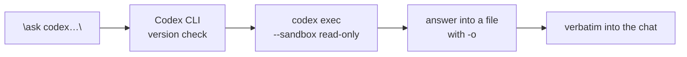

<div align="center">

# hey-codex

### Claude Code skill (works in any agent): calls the OpenAI Codex CLI for a second opinion, a task, or an image

[](LICENSE)
[](https://code.claude.com/docs/en/skills)
[](https://github.com/openai/codex)

**A second opinion from another model — without leaving the chat.
The sandbox is set explicitly in every call: `read-only` by default, writing switches on only when you asked for files to be edited or a picture to be saved.**

[Installation](#installation) · [Configuring Codex](#configuring-codex) · [Usage](#usage) · [Limitations](#limitations)

</div>

---

## What it does


You tell your agent "ask codex" — the skill assembles a `codex exec` command, runs the locally
installed OpenAI Codex CLI, collects the final answer from a file and quotes it in the chat verbatim.
You can ask about anything: copy, a decision, a screenshot, code. Codex cannot see your conversation
with Claude, so a short header is added to the question — what this is about and what has already
been established.

Beyond text answers it also **looks at images** (reads screenshots, diagrams, fine print on photos)
and **generates them** — the picture is drawn by the built-in generator and the finished file is
saved to disk.

And it **hands Codex a task by spec**: Claude writes the spec — the result, the context, the
constraints, the check that proves it is done — Codex implements it in the project, Claude reruns
the check itself and shows `git diff --stat`. A fix round reuses the same Codex session.

| At a glance | |
|---|---:|
| What it does | **calls the Codex CLI from your agent** |
| Handles | **text · tasks by spec · reading images · generating images** |
| Default sandbox | **`read-only`, set explicitly in every call** |
| Writing to files | **only when explicitly asked, or to save a picture** |
| Requires API keys | **no — sign-in with a ChatGPT account** |
| External dependency | **`@openai/codex` (npm)** |
| License | **MIT** |

## Why

- **A second model within reach** — GPT-6 Astra looks at the same task with fresh eyes: copy, a plan, a contested decision, code.
- **No context switching** — no second terminal, no copy-pasting, no retyping the task.
- **Images both ways** — from reading an error screenshot to a finished illustration, without leaving the chat.
- **The dangerous Codex default is defused** — a typical config allows writing anywhere without asking; the skill passes `--sandbox read-only` in every call and enables writing only when you asked for it.
- **The answer is not paraphrased** — Codex writes its final text to a file, Claude quotes it verbatim and adds any disagreement as a separate block.
- **Follow-ups are cheap** — "what would it say about…" resumes the same session instead of starting the analysis over.

## Installation

One command, and the skill is available as `/hey-codex`:

```bash
npx skills@latest add warodan/hey-codex
```

The [skills.sh](https://skills.sh/) installer finds the agents you have installed and asks where to
put it. After installing, **restart your agent** — skills are read at startup. Node.js is needed for
this, but it is required for the Codex CLI itself anyway.

**Where it lands** — the installer asks whether to put the skill into the current project or
globally, for every project; `-g` skips the question and installs globally.

### Or have your agent install it

No terminal of your own, no flags to choose. Open your AI agent — Claude Code, Cursor, Codex — and
paste this to it:

```
Install the hey-codex skill for me. Run in the terminal:

npx skills@latest add warodan/hey-codex -g -y -a <your own agent: claude-code, cursor, codex>

If npx is not found — give me a link to download Node.js and wait.
Do not install anything else.
When you are done — tell me in one line that it is ready and that the session needs a restart.
```

The agent does the rest. This is the command for the **first** install; updating uses a different
one, below.

### Codex itself

The skill is instructions, not the tool. The Codex CLI is installed separately:

```bash
npm install -g @openai/codex
codex login                      # opens a browser, sign in with a ChatGPT account
codex --version && codex login status
```

### Updating and removing

```bash
npx skills@latest update hey-codex
npx skills@latest remove hey-codex
```

The Codex CLI itself is updated by the skill on its own, see [How it works](#how-it-works). In Claude
Code that check finds its script whatever folder the skill sits in; other agents fall back to the
standard skill folders, and if the skill lives somewhere else the check is simply skipped — the rest
of the skill works either way.

## Configuring Codex

**This section is worth reading in full: it is about what an agent is allowed to do on your disk.**

The skill deliberately does not set the model, the reasoning effort or the speed with flags — it takes
them from your `~/.codex/config.toml` (on Windows — `%USERPROFILE%\.codex\config.toml`). The file is
created by Codex itself on first run.

The skill writes nothing into that file and requires no particular values — it works with any config.
There is nothing to set up for it.

But two settings deserve attention, because they decide what Codex can do to your machine.
**Do not copy them to yourself** — the reason is below:

```toml
sandbox_mode = "danger-full-access"   # ← dangerous, see below
approval_policy = "never"             # ← dangerous, see below
```

### What those two lines mean

| Setting | What it means in practice |
|---|---|
| `sandbox_mode = "danger-full-access"` | Codex runs **without a sandbox**: it can read, modify and delete any file your account can reach, and go online freely. Not just the current project — the whole disk. |
| `approval_policy = "never"` | Codex **asks nothing** before running commands. There will be no confirmation. |

Together that is an agent quietly doing whatever it sees fit with your machine. Such a config is
convenient for interactive work and entirely unfit as an invisible default for automated calls.

### How the skill defends against that

- **An explicit `--sandbox read-only` in every call.** A command-line flag overrides the config: Codex
  reads the code and answers in text, and cannot write.
- **Writing is a separate mode.** `--sandbox workspace-write` is used only if you said outright "let
  codex write it"; the permissions are limited to the working folder plus one scratch folder for
  temporary files. After the edits the skill reruns the check named in the spec and shows
  `git status` and `git diff --stat` so the changes are visible.
- **Resuming a session is covered too.** `codex exec resume` has no `--sandbox` flag, so the sandbox is
  passed as `-c sandbox_mode="read-only"` — otherwise a follow-up question would inherit
  `danger-full-access` from the config.
- **The skill never passes `danger-full-access`.**

**An important caveat.** The explicit flag protects this skill's calls only. Interactive `codex` in a
terminal, other wrappers and your own commands will still take the default from the config. So it is
safer not to keep a dangerous value in the config at all.

### A recommended config

```toml
model = "gpt-6-astra"           # or another model available to you
model_reasoning_effort = "high" # low | medium | high | xhigh | max | ultra
service_tier = "default"
sandbox_mode = "workspace-write"
approval_policy = "on-request"
```

With the skill, a config like this works exactly the same: the sandbox is passed explicitly in every
call regardless. The difference is that when you run Codex outside the skill you get safe behaviour
instead of full disk access.

One more section people trip over — trusted folders:

```toml
[projects.'/path/to/repository']
trust_level = "trusted"
```

Without it (and without `--skip-git-repo-check`) Codex refuses to start, saying
`Not inside a trusted directory`.

The `sandbox_mode` values, from strict to permissive: `read-only` → `workspace-write` →
`danger-full-access`. The full parameter list is in the [Codex CLI documentation](https://github.com/openai/codex),
and `codex doctor` diagnoses the installation.

## Usage

The skill picks itself up when you ask for something that fits:

```text
have codex look at the src folder and say what is wrong there
```

A project review: Codex reads the files itself, answers on the substance and changes nothing — the
sandbox is `read-only`.

```text
let codex write it: retry with backoff in the http client, tests included
```

A task by spec: Claude writes the spec with a check that proves the task is done, `workspace-write`
switches on, Codex implements it, Claude reruns the check and shows `git diff --stat` — so you can
see exactly what it did.

```text
show codex this screenshot and ask why everything is out of place
```

Reading an image. It reads precisely: colours, element positions, fine print in the picture.

```text
have codex draw a cover: a fox in headphones, flat illustration, calm colours
```

Generating an image. The picture is drawn by the built-in generator and the finished file is saved to disk.

```text
what does codex think of this idea — ask it word for word, no project context
```

The model's plain opinion: the run happens outside the project — Codex sees neither the code nor `AGENTS.md`.

```text
ask codex to clarify why it suggested that particular option
```

Resuming the same session: Codex remembers its analysis and does not start over.

Or call it explicitly:

```text
/hey-codex have it review the src folder and suggest what to fix first
```

## How it works



1. **Update check.** No more than once a day, `check_update.sh` compares the installed version against
   npm and runs `codex update` itself when behind. Checked less than 24 hours ago — an instant
   `skipped`, nothing happens.
2. **Assembling the prompt.** Your question verbatim plus a two-or-three-line header: what this is
   about, where to look, what has already been established. Codex cannot see the conversation with
   Claude. If an image is involved, it is attached with `-i`. The assembled prompt is written to a
   temporary file — that is where Codex reads it from.
3. **The run.** `codex exec --sandbox read-only -c features.plugins=false -C <folder> -o <file>
   < <prompt file>`. Codex plugins are disabled in every call: otherwise it reads their instructions
   on every question and answers by them rather than for itself — ask, and the skill brings them back.
   The prompt is fed as a file on stdin rather than as a command argument: on Windows an argument goes
   through `codex.cmd`, and everything after the first newline is silently lost. For image generation
   and file edits, `workspace-write` is used instead of `read-only` — otherwise there is nowhere to
   save the result. A task goes in as a spec file with a check that proves it is done, and Codex
   gets one extra writable scratch folder (`--add-dir`) for temporary files, so they stay out of
   the project.
4. **Collecting the answer.** The final text is written to a file with `-o` — and that is what gets
   read. This way there is no service output to clean up, and non-ASCII text does not break in the
   Windows console.
5. **Delivery.** The answer is posted verbatim under a "Codex answer" heading. A long answer stays in
   the file, and the chat gets a link and a summary. Claude adds its own opinion as a separate block,
   without mixing it into someone else's text.
6. **After that.** A follow-up on the same topic — `codex exec resume --last`; a new topic — a new
   session. Long runs (a big task, a series of pictures) go to the background: Claude carries on
   working and reports when they are done.

## Requirements

| Requirement | Details |
|---|---|
| An agent with skills | Claude Code, plus any agent `npx skills` installs into (Cursor, Copilot, Gemini CLI and others) |
| Node.js and npm | needed to install and update `@openai/codex` |
| Codex CLI | `npm install -g @openai/codex`, verify with `codex --version` |
| A ChatGPT account | `codex login` — the work runs on the subscription, no API key needed |
| A POSIX shell (`sh`) | for every call — the prompt is fed through stdin — and for `check_update.sh`; on Windows the Git Bash shipped with Git for Windows will do, and the skill has a separate command form for PowerShell |
| git | by default Codex requires being run inside a git repository or a trusted folder |
| `~/.codex/config.toml` | see [Configuring Codex](#configuring-codex) |

## What's inside

```
hey-codex/                   # the repository
├── skills/hey-codex/        # ← the only thing that gets installed
│   ├── SKILL.md             # the skill instructions: how to call Codex
│   ├── REFERENCE.md         # flags, subcommands, pitfalls, diagnostics
│   ├── check_update.sh      # daily Codex CLI version check
│   └── LICENSE
├── assets/
│   └── demo.svg             # README image
├── LICENSE
└── README.md
```

## Limitations

- **The question leaves your machine.** The prompt, code fragments and attached images are sent to
  OpenAI servers and handled under the terms of your ChatGPT account — same as with ordinary Codex use.
- **It mutes Codex plugins.** Every call carries `-c features.plugins=false`, so the Codex plugins you
  installed take no part in these calls — ask, and the skill brings them back. Codex skills stay:
  there is nothing that turns those off.
- **It does not install Codex for you.** The first install, `codex login` and the contents of
  `config.toml` are done by hand. The skill only assembles commands.
- **It updates the Codex CLI on its own.** Once a day it may run `codex update` (which is
  `npm install -g`). If you need a pinned version — delete `check_update.sh` and §0 in `SKILL.md`.
- **It does not check whether Codex is right.** The answer is delivered verbatim, unverified. Edits made
  in `workspace-write` are verified only by the check named in the spec, which Claude reruns; there
  is no review round unless you ask for one.
- **Image generation is imprecise in the details.** Fine print, strict geometry and requested dimensions
  do not always come out on the first try — the result is worth a look and possibly a redo.
- **Codex marks folders as trusted on its own.** Every `codex exec` in a new folder — including the
  temporary one used for a bare question — adds a `[projects]` entry to your `config.toml`. That is
  Codex behaviour, not the skill's; the skill never edits the file, so the entries stay until you
  remove them.
- **The `read-only` protection covers the skill's calls only.** Dangerous values in your `config.toml`
  stay dangerous for everything else that launches Codex.
- **It is not free.** The work runs on your ChatGPT subscription; heavy runs eat noticeably into the
  limit. The OpenAI API-key authentication route has not been tested.
- **Model names age.** `gpt-6-astra`, `gpt-5.6-sol` and the rest are current as of publication; the live
  list lives in `~/.codex/models_cache.json` and changes on OpenAI's side.

## License

MIT — see [LICENSE](LICENSE). © 2026 Daniel Orr.

---

<div align="center">
<sub><b>Skills for Claude Code</b> · <a href="https://github.com/warodan?tab=repositories">more skills in the series</a></sub>
</div>
